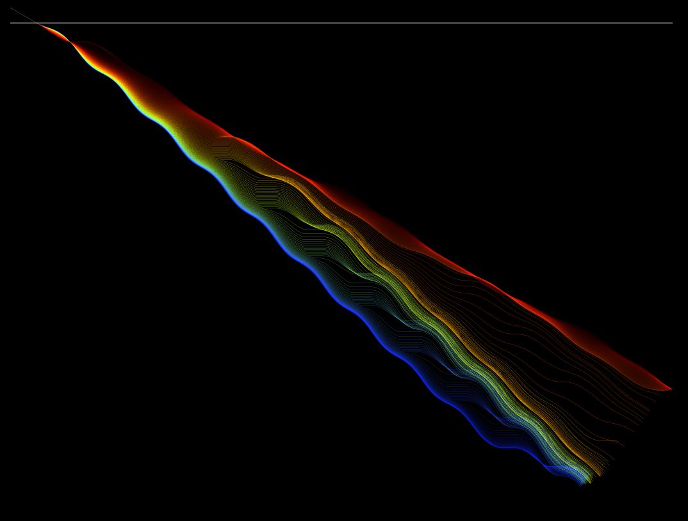

# Overview
This is a simple simulation of a light ray going through a material with a varying refractive index.
<p align="center">
  
</p>

$N(x,y,\lambda) = N_0 + \sin x \sin y \sin A*\lambda$

$N$: Refractive index

$N_0$: Original material refractive index

$A$: Proportionality constant

$\lambda$: Wavelength

# The Physics
I simply used the Snell-Descartes law on refraction: $N_0 \sin \theta_0 = N_1 \sin \theta_1$

I then simply trace the light ray using Euler's Method.

You can edit the code to create different light paths.

# File format
The generated images are in the ppm file format:
```
P3
WID HEI
MAX_COLOUR
R G B
R G B
R G B
[...]
```
# Final message
Enjoy C:
